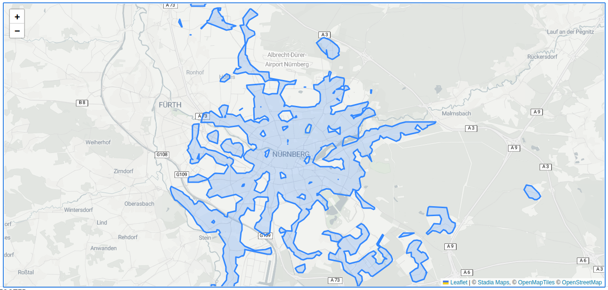
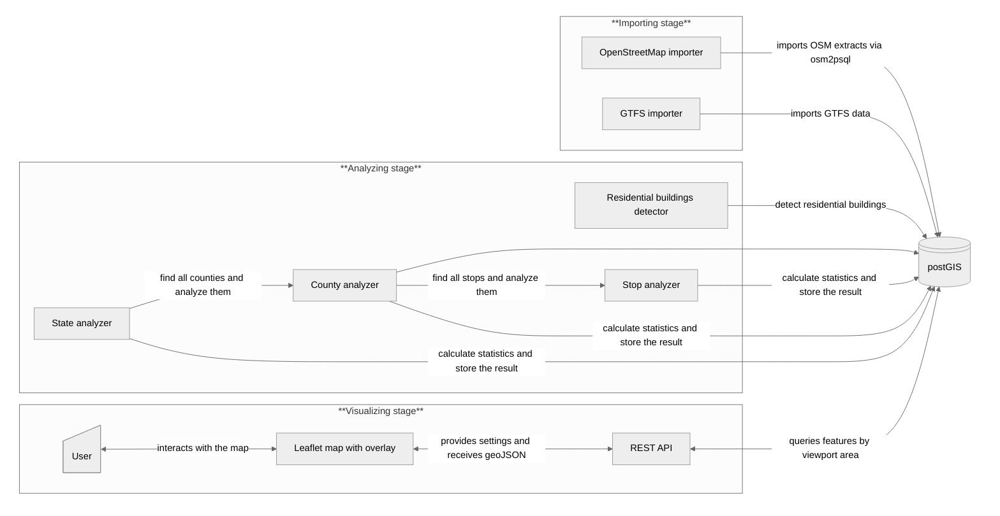

# mobility-map - Visualize public transportation accessibility in Germany

Germany has one of the most accessible public transportation systems in the world, with an extensive [rail network spanning over 38,000 kilometers][1] and more than [1,000 public transport providers][2] ensuring widespread connectivity.

This project aims to visualize public transport accessibility at an individual level by overlaying relevant data on a rendered OpenStreetMap. Users will be able to explore their surroundings interactively, identifying where public transport is readily available and where gaps exist.

By making accessibility information more intuitive and visually engaging, the project bridges the gap between raw statistics and practical usability. It empowers users to gain a deeper understanding of public transport availability—insights that would otherwise remain buried in datasets and timetables.



### What means access to public transportation?

If an area has access to public transportation is determined by the following characteristics:

1) The network can be accessed by a stop
2) The stop is operated frequently (variable between 10 minutes  - 2 hours)
3) The stop is reachable within a certain distance (variable between 100 meters  - 2000 meters)

Both 2. and 3. depends on the individual needs of the user and can be changed to adapt the map according to their needs.

### Functional requirements

---

* The user can navigate the map freely to explore the areas of interest.

- The map displays statistical information about:
  - How many inhabitants have public transport access to a certain area compared to all inhabitants
  - How many stops are available in the current displayed area
- The map is staged into different zoom levels. States view, county view and detail view allows to roam freely
- Users can change the frequency and distance setting to adapt the map according to their needs

### Technical design

---

The project works in 3 stages:

1) Import of the OpenStreetMap data into a PostGIS database and extract GTFS information from publicly available archives
2) Analyze the imported data and calculate intermediary results such as detected residential buildings and precomputed metrics
3) Visualize the result as a interactive OpenStreetMap overlay using leaflet



This project is part of my efforts in the Coursera course: https://www.coursera.org/learn/software-architecture-for-big-data-applications

### Data availability

---

The data used by this project is available here:

- OpenStreetMap Germany extract:  https://download.geofabrik.de/europe.html
- GTFS data Germany wide: https://www.opendata-oepnv.de/ht/en/organisation/delfi/start?tx_vrrkit_view%5Baction%5D=details&tx_vrrkit_view%5Bcontroller%5D=View&tx_vrrkit_view%5Bdataset_name%5D=deutschlandweite-sollfahrplandaten-gtfs&cHash=af4be4c0a9de59953fb9ee2325ef818f

Data subsets are available for testing and development:

* OpenStreetMap Bavarian extract: https://download.geofabrik.de/europe/germany/bayern.html
* VGN GTFS dataset: https://www.vgn.de/web-entwickler/open-data/

### Application dependencies

---

The application is a mixture out multiple languages but primarily implemented in Rust. The following projects are used in this project:

* **PostGIS** https://postgis.net/
* **osm2psql**: https://osm2pgsql.org/
* **sqlx**: https://github.com/launchbadge/sqlx
* **apalis**: https://github.com/geofmureithi/apalis
* **axum**: https://github.com/tokio-rs/axum
* **leaflet**: https://leafletjs.com/
* **bootstrap**: https://getbootstrap.com/

### Development setup

---

First make sure you have the following host dependencies installed on you system:

  * `docker-compose` - A running docker-compose version
  * `make` - To run scripts to aid development process

```
# setup environment and edit as needed
cp .env.example .env

# build the application
make build

# migrate the new created database
make migrate-db

# run OSM import
# NOTE: make sure you have downloaded required osm data and gtfs available in the /data directory.
#       See the .env file for information where to obtain the initial data
make import-osm-data

# run GTFS import
make import-gtfs-data

# analyze data and calculate itermediary results
make analyze-state-data

# run frontend
make frontend
```


[1]: https://www.statista.com/statistics/451500/length-of-railway-lines-in-use-in-europe/
[2]: https://www.opendata-oepnv.de/ht/en/organisation/delfi/start?tx_vrrkit_view%5Baction%5D=details&amp;tx_vrrkit_view%5Bcontroller%5D=View&amp;tx_vrrkit_view%5Bdataset_name%5D=deutschlandweite-sollfahrplandaten-gtfs&amp;cHash=af4be4c0a9de59953fb9ee2325ef818f
