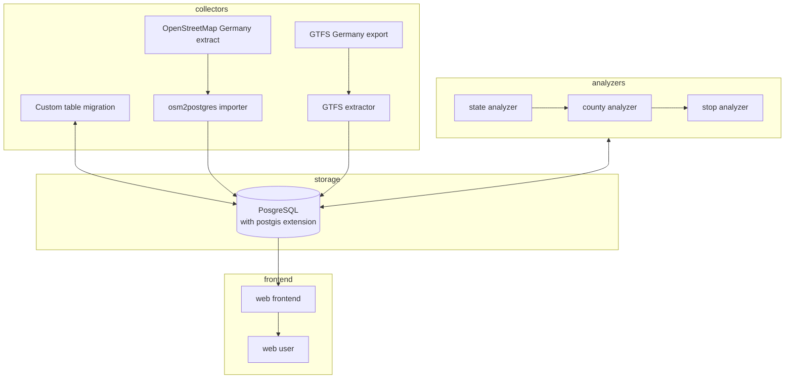

# mobility-map - Access to public transportation in Germany

Germany has one of the most extensive rails network systems in the world transporting freight and personal on a daily basis across the country.

Due to ongoing discussions surrounding accessibility of public transportation in Germans political discussions the question raised: 

**What does accessibility mean and how many people have potential access to the network?**

This experiment aims to visualize potential access to existing **bus** and **rail** network via publicly available OSM and GTFS data.

<pic of the map here>

This experiment is part of my efforts in the Coursera course: https://www.coursera.org/learn/software-architecture-for-big-data-applications

## Index

## Definition

## Requirements

## How to run locally

---

---

There are multiple interesting questions surrounding German public transport network which are hard to answer and scientific studies are scarce. Therefore this experiment in form of a software engineering project aims to give initial data to 

The question: **How much of the total population has access to public transport** is what drives this project.

The idea is to 

