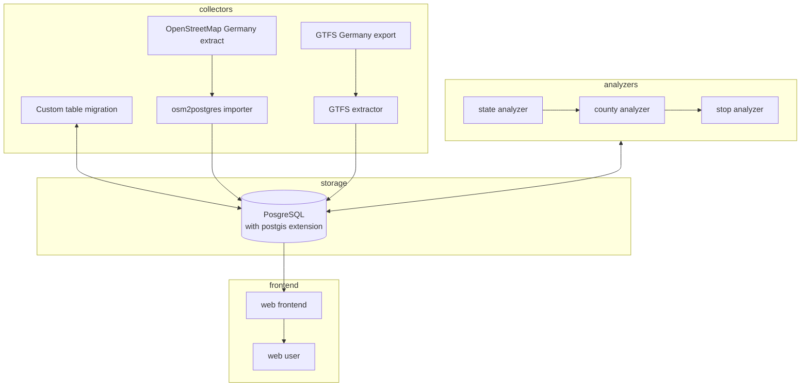

# mobility-map - Access to public transportation in Germany

Germany has one of the most extensive rails network systems in the world transporting freight and personal on a daily basis across the country.

Due to ongoing discussions surrounding accessibility of public transportation in Germans political discussions the question raised: 

**What does accessibility mean and how many people have potential access to the network?**

This experiment aims to visualize potential access to existing **bus** and **rail** network via publicly available OSM and GTFS data.

<pic of the map here>

This experiment is part of my efforts in the Coursera course: https://www.coursera.org/learn/software-architecture-for-big-data-applications

## Index

## Definition




## Requirements

## How to run locally

First make sure you have the following host dependencies installed on you system:

  * `docker-compose` - A running docker-compsoe version
  * `make` - To run abitrary scriptlets to aid development process

```

# setup environment and edit as needed
cp .env.example .env

# build the application
make build

# migrate the new created database
make migrate-db

# run OSM import
# NOTE: make sure you have downloaded required osm data and gtfs available in the /data directory.
#       See the .env file for information where to obtain the initial data
make import-osm-data

# run GTFS import
make import-gtfs-data

# analyze data (optional: this is required if you want to see overall statistics. plain frontend view works without it)
make analyze-state-data

# run frontend
make frontend
```
